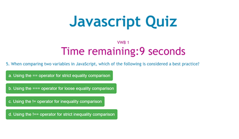

# 04 Web APIs: Code Quiz

## Description

The Javascript Quiz is a timed coding quiz with multiple-choice questions. This app will run in the browser and will feature dynamically updated HTML and CSS powered by JavaScript code. It has a clean, polished, and responsive user interface. 

## User Story

AS A coding boot camp student

I WANT to take a timed quiz on JavaScript fundamentals that stores high scores

SO THAT I can gauge my progress compared to my peers

## Acceptance Criteria

GIVEN I am taking a code quiz

WHEN I click the start button THEN a timer starts and I am presented with a question

WHEN I answer a question THEN I am presented with another question

WHEN I answer a question incorrectly THEN time is subtracted from the clock

WHEN all questions are answered or the timer reaches 0 THEN the game is over

WHEN the game is over THEN I can save my initials and my score

## Visual

The following image shows a view of the quiz in progress.

## License

## Deployed Application

View the deployed application on Github at [https://vwbutler.github.io/javascript-quiz/](https://vwbutler.github.io/javascript-quiz/).

## Need help?

Contact [Virginia Butler](https://github.com/vwbutler) through Github.